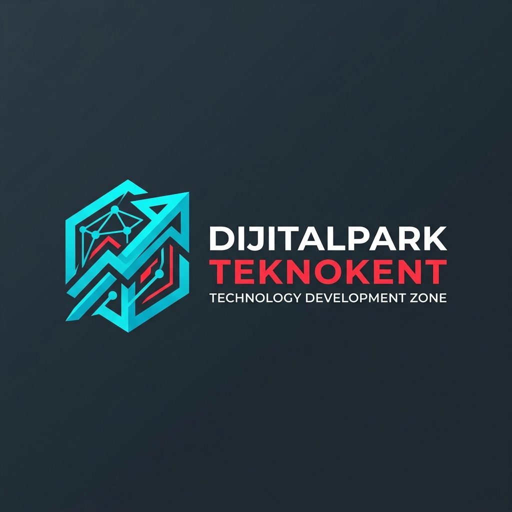

# 🚀 Dijitalpark Teknokent Connect

Dijitalpark Teknokent bünyesindeki Ar-Ge firmaları, kuluçka girişimleri ve teknoloji ekipleri için tasarlanmış **Twitter & LinkedIn melezi profesyonel inovasyon ve etkileşim platformu**.



---

## 🎨 Tasarım & Kurumsal Kimlik
- **Ana Renkler:**
  - 🌐 **Teknokent Turkuazı / Cyan:** `#00B4D8` / `#00C8D7` (Dijital inovasyon ve teknoloji)
  - 🔴 **Teknokent Kırmızısı:** `#EE202E` / `#E63946` (Dinamizm, enerji ve girişimcilik)
  - 🌌 **Koyu Gece Modu (Dark Navy):** `#0A0F1D`, `#141E34` (Modern yazılımcı ve mühendis estetiği)
  - ☀️ **Açık Tema Desteği:** Sağ üstteki butonla tek tıkla Aydınlık Moda geçiş.
- **Tipografi:** Plus Jakarta Sans (Google Fonts)

---

## ✨ Öne Çıkan Özellikler

1. **👥 3 Adet Hazır Test Hesabı (Anında Geçiş):**
   - **Enes Erdem Çarkıt** (Kurucu Ortak & Lead AI Engineer - Neurologic AI / Çekmeköy)
   - **Ali Nihat Eryürek** (Senior Cloud & Systems Architect - CloudScale Tech / Ataşehir)
   - **Batuhan Akyazı** (Head of Product & Growth Partner - Core Innovation Hub / Çekmeköy)
   - *Sağ taraftaki "Hesap Değiştirici" paneliyle tek tıkla istediğiniz profile geçebilir, birbirinizin gönderilerini beğenip yorum yazabilir ve sohbet edebilirsiniz.*

2. **📰 Etkileşimli Gönderi Akışı (Feed):**
   - Metin ve fotoğraf paylaşımı (Dosya yükleme veya hazır Ar-Ge laboratuvarı/Lansman görselleri).
   - Kişisel profil veya Şirket hesabı adına paylaşım yapabilme seçeneği.
   - Hızlı etiketleme (`#YapayZeka`, `#ArGe`, `#Girişimcilik`, `#Yatırım`, `#AkıllıKampüs`).
   - Beğenme (❤️), Yorum yapma (💬), Yeniden paylaşım (🔄) ve Paylaşım bağlantısı kopyalama.
   - Kategori filtreleme: Tümü, Ar-Ge & AI, Startuplar, Etkinlikler.

3. **💬 LinkedIn Tarzı Canlı Sohbet Sistemi:**
   - Sağ alt köşede sabit duran (docked) açılır-kapanır mini mesajlaşma kutusu.
   - Çevrimiçi/aktiflik durumu göstergeleri (🟢 Online).
   - Pop-up sohbet penceresi, anlık mesaj gönderme, hazır hızlı cevap butonları ("Kahve içelim ☕️", "Çok iyi görünüyor 🚀").
   - Gerçekçi karşılıklı konuşma simülasyonu.

4. **👤 Profil & 🏢 Şirket Hesabı Açma:**
   - Bireysel profil düzenleme modalı (Ad, unvan, şirket, biyografi, yerleşke seçimi).
   - Yeni startup / Ar-Ge şirketi kayıt modalı (Sektör, ekip büyüklüğü, ofis no).

5. **💾 Sıfır Bağımlılık & Yerel Hafıza (LocalStorage):**
   - Yapılan her paylaşım, yorum ve mesaj tarayıcı hafızasında kalıcıdır. Sayfa yenilendiğinde kaybolmaz.
   - İstenildiğinde "Test Verilerini Sıfırla" butonuyla ilk fabrika ayarlarına dönülebilir.

---

## ⚡ Vercel ile Yayına Alma (Deploy)

Bu proje sıfır harici derleme gereksinimi (zero-build) ile doğrudan statik web sitesi olarak tasarlanmıştır.

### Yöntem 1: GitHub & Vercel Dashboard (En Kolay)
1. Bu klasörü bir GitHub deposuna (repository) yükleyin:
   ```bash
   git init
   git add .
   git commit -m "feat: initial Dijitalpark Teknokent Connect"
   git branch -M main
   git remote add origin https://github.com/KULLANICI_ADINIZ/teknokent-connect.git
   git push -u origin main
   ```
2. [vercel.com](https://vercel.com) adresine gidin.
3. **"Add New Project"** butonuna tıklayın ve GitHub deponuzu seçin.
4. Framework Preset: **Other** (Root directory: `./`)
5. **"Deploy"** butonuna basın. Birkaç saniye içinde siteniz canlı yayında! 🚀

### Yöntem 2: Vercel CLI
```bash
npx vercel
```
İstemleri onaylayarak doğrudan terminalden yayına alabilirsiniz.

---

## 💻 Yerel Olarak Çalıştırma
Herhangi bir kurulum gerekmez. `index.html` dosyasını doğrudan Google Chrome, Edge veya Safari ile açabilir ya da VS Code Live Server / Python HTTP Server ile çalıştırabilirsiniz:
```bash
# Python ile:
python -m http.server 3000
```
Tarayıcınızda `http://localhost:3000` adresine gidin.
